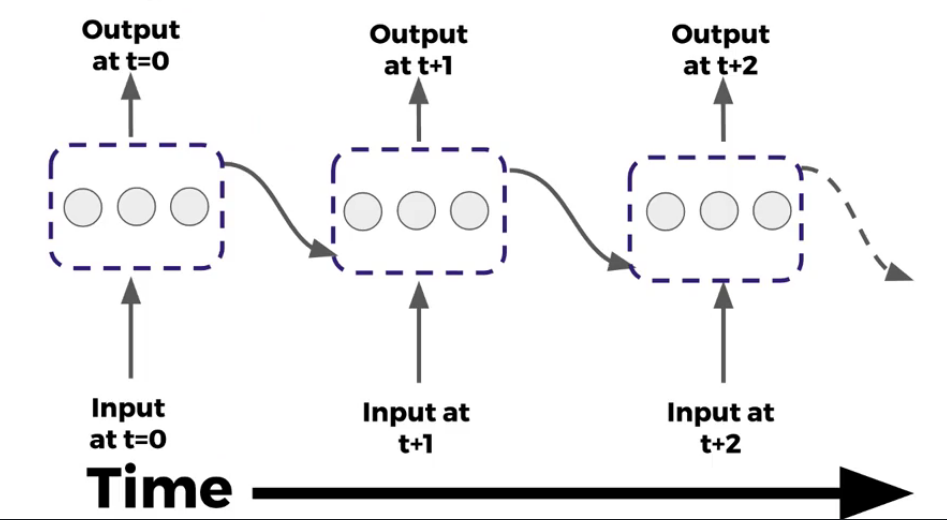
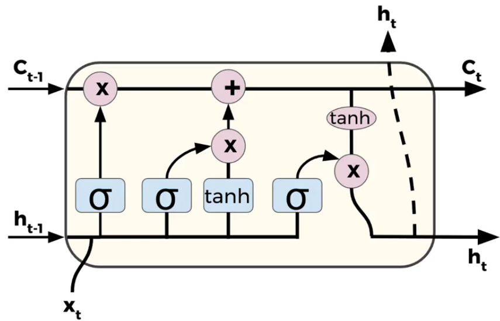

### [Home](index.html)

# Chatbot Keras:

This was an open project where I could chose to do whatever I wanted that relates to Machine Learning. I decided to do a simple chatbot you can talk to.

## How I approached the project:

For this project, I decided to use Keras, a high level deep learning library in Python. I have three seperate python files that make up my bot, 'generate_data.py', 'train.py' and 'chat.py' and you run them in that order. I will go over what each of those files do.

### Generate Data:

In this file I turn all my conversation training data into vectors using word2vec. First, I tokenize my data, which is splitting a sentence up into words. I have a word2vec.bin file that already has a vector for each word. I have commented my code to show what each part of my code does. In the end I save my data into a .pickle file to later be loaded.

### Train:

Here I make the model of neural network and train it on my data (extracted from the .pickle file). Here is my model:

```python
model = Sequential()
model.add(LSTM(output_dim=300, input_shape=x_train.shape[1:], return_sequences=True,
               init='glorot_normal', inner_init='glorot_normal', activation='sigmoid'))
model.add(LSTM(output_dim=300, input_shape=x_train.shape[1:], return_sequences=True,
               init='glorot_normal', inner_init='glorot_normal', activation='sigmoid'))
model.add(LSTM(output_dim=300, input_shape=x_train.shape[1:], return_sequences=True,
               init='glorot_normal', inner_init='glorot_normal', activation='sigmoid'))
model.add(LSTM(output_dim=300, input_shape=x_train.shape[1:], return_sequences=True,
               init='glorot_normal', inner_init='glorot_normal', activation='sigmoid'))
model.compile(loss='cosine_proximity', optimizer='adam', metrics=['accuracy'])
```

### RNN Theory:

A recurrent neural network is a great way to solve problems involving sequences, such as time series data (sales), sentences, audio etc. You can imagine a sequence as a vector of information where the index location points out its point in time. Unlike a normal neuron in a feed forward network, a recurrent neuron sends the ouput back to itself.

As you can see, the neurons are recieving inputs from the previous timestep and the current timestep. You can do the same thing for multiple layers.

Since the output of these recurrent neurons at a certain timestep is technically a function from all the previous timesteps, you can then begin to think it has some sort of memory. Cells that are a function of inputs from previous time steps are also known as 'memory cells'.

### LSTM Theory:

LSTM is a way to keep the memory of initial inputs in a sequence so the network doesn't "forget" the first inputs, as information is lost at each step going through the RNN. We do this by modifying the 'memory cells' of a recurrent neural network. This is what an LSTM cell looks like.

Here we still have those original inputs from a normal RNN, but now we have a third input, called the 'cell state', represented as Ct-1. As outputs we have Ht, which is the original output, but now we also have a new cell state, Ct.

The very first step is called the forget gate layer. In this step we decide what information we're going to forget from the cell state. Because it's a sigmoid layer, it's always going to output something between 0 and 1, where 1 will represent to keep it and 0 will represent to get rid of it.

The next step is where we decide what information we want to store in the cell state. The first part is a sigmoid layer and the second part if a hyperbolic tangent layer. The sigmoid layer is called the input gate layer, and it returns values from 0 and 1. The second part is the hyperbolic tangent layer, which ends up creating a vector called 'new candidate values', which are candidate values that could be added to the state. In the next step, we combine these two to create an update to the cell state.

Here we update the old cell state by multiplying the old state by the vector outputted by the forget gate, which ends up forgetting the information we decided we want to forget. Then we add the input gate layer output times the candidate values. This scales the new candidate values by how much we decided to update each state value.

Our last step is what we output for Ht and Ct. This is going to be based off your cell state, just a filtered version. Using Ht-1 and Xt, we pass that into a sigmoid layer, which decides what parts of the cell state we're going to be outputting. Then we put the cell state through a hyperbolic tangent so it pushes the values to be between -1 and 1 and we're going to then multiply it by the outputs of the sigmoid gate, so that we only output the parts that we decided to.

### Chat:

In my chat.py file, I essentially run a while loop forever that asks the user for input. I then transform the user's input into data I can feed into my model by first tokenizing it and then transforming the words to vectors using the same word2vec proccess I used when generating my data. I then print out the output.

## Reflection on the challenges I faced:

The biggest challenge I faced was training. It would take extremely long to train my model, only to have it be not so good (aka the chatbot responded gibberish). Find good data to train it on was also hard. In the end, I decided to look for already pre-tained weights online that would fit my model when presenting so it didn't output gibberish.
